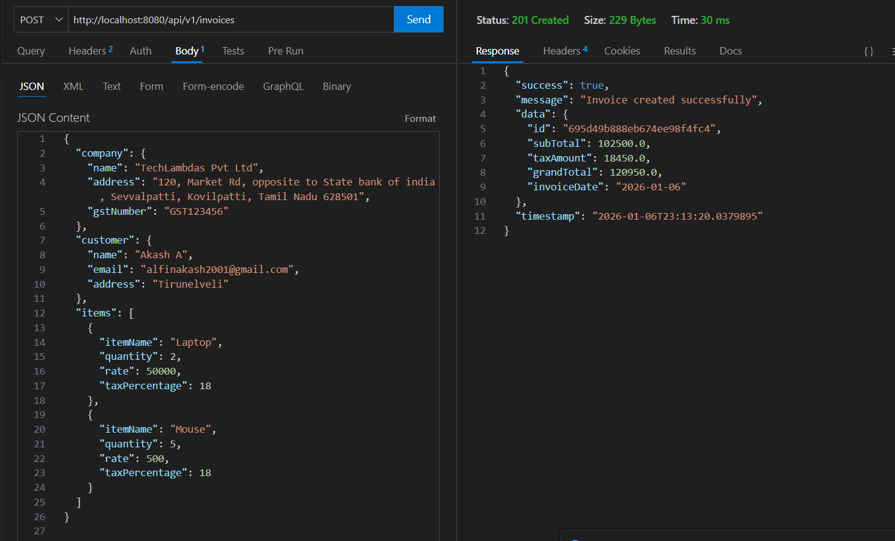
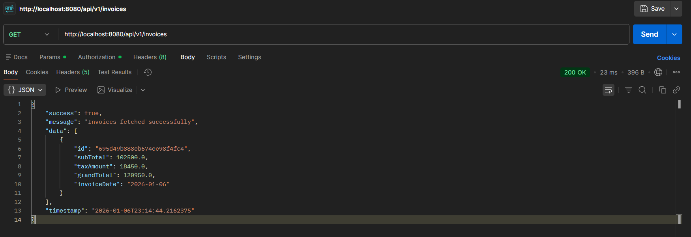
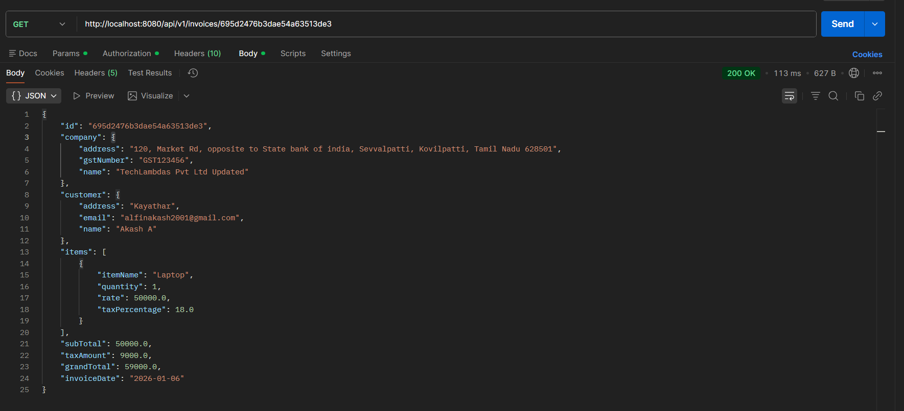
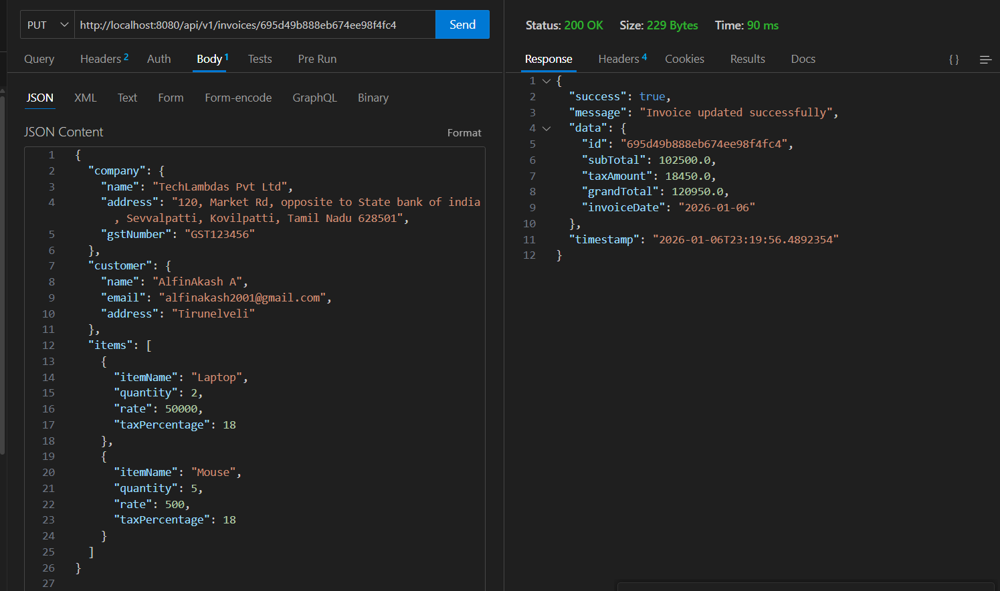
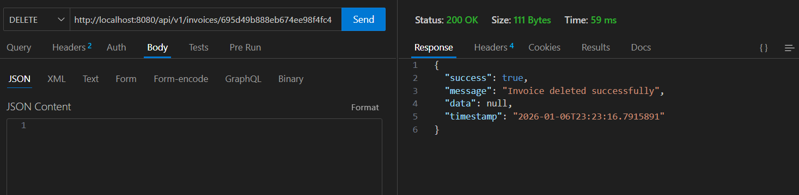
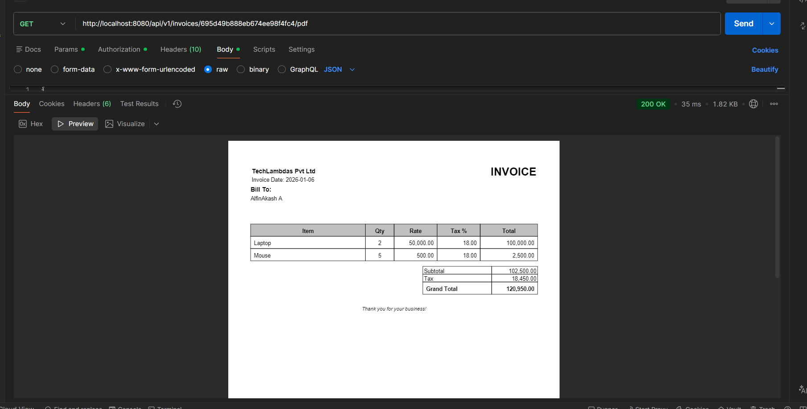

# Invoice Generator Application

A Spring Boot–based Invoice Generator application that provides REST APIs to create, retrieve, and manage invoices using MongoDB. The application also supports PDF invoice generation.

---

##  Tech Stack

* **Java**: 21
* **Spring Boot**: 4.0.1
* **MongoDB**:Local MongoDB
* **Spring Data MongoDB**
* **OpenPDF**: PDF generation
* **Maven**: Build tool

---

## Docker Support
The application can be containerized and run using Docker.
A Dockerfile is included in the repository.

```
docker build --no-cache -t alfinakash/invoice-generator:latest .
```

Push Docker Image to Docker Hub

```
docker login
docker push alfinakash/invoice-generator:latest
```

Pull Docker Image from Docker Hub
```
docker pull alfinakash/invoice-generator:latest
```

Run Application Using Docker

```
docker run -p 8080:8080 \
  -e MONGODB_URI=<your_mongodb_uri> \
  alfinakash/invoice-generator:latest
```

Application will be available at:

```
http://localhost:8080
```

## Deployment

The backend service is deployed and publicly accessible.

**Base URL (Production):**

```
https://invoice-generator-backend-service.onrender.com
```

All API endpoints listed below can be accessed by replacing `http://localhost:8080` with the above base URL.

---

## Screenshots

### CreateInvoice


### GetAllInvoices


### GetInvoiceByID


### UpdateInvoiceByID


### DeleteInvoiceByID


### GetInvoicePDF



## Invoice PDF

[Invoice Pdf](images/Invoice-Pdf.pdf)

# API Endpoints
## Create Invoice

- **Method:** `POST`  
- **URL:** `http://localhost:8080/api/v1/invoices`

### Request Headers

- `Content-Type: application/json`

### Request Body

```json
{
  "company": {
    "name": "TechLambdas Pvt Ltd",
    "address": "120, Market Rd, opposite to State Bank of India, Sevvalpatti, Kovilpatti, Tamil Nadu 628501",
    "gstNumber": "GST123456"
  },
  "customer": {
    "name": "AlfinAkash A",
    "email": "alfinakash2001@gmail.com",
    "address": "Tirunelveli"
  },
  "items": [
    {
      "itemName": "Laptop",
      "quantity": 2,
      "rate": 50000,
      "taxPercentage": 18
    },
    {
      "itemName": "Mouse",
      "quantity": 5,
      "rate": 500,
      "taxPercentage": 18
    }
  ]
}
```
## GetAll Invoice

- **Method:** `GET`  
- **URL:** `http://localhost:8080/api/v1/invoices`


## Get Invoice ById

- **Method:** `GET`  
- **URL:** `http://localhost:8080/api/v1/invoices/{id}`


## Update Invoice ById

- **Method:** `PUT`  
- **URL:** `http://localhost:8080/api/v1/invoices/{id}`

### Request Body

```json
{
  "company": {
    "name": "TechLambdas Pvt Ltd",
    "address": "120, Market Rd, opposite to State Bank of India, Sevvalpatti, Kovilpatti, Tamil Nadu 628501",
    "gstNumber": "GST123456"
  },
  "customer": {
    "name": "AlfinAkash A",
    "email": "alfinakash2001@gmail.com",
    "address": "Tirunelveli"
  },
  "items": [
    {
      "itemName": "Laptop",
      "quantity": 2,
      "rate": 50000,
      "taxPercentage": 18
    },
    {
      "itemName": "Mouse",
      "quantity": 5,
      "rate": 500,
      "taxPercentage": 18
    }
  ]
}
```

## Delete Invoice ById

- **Method:** `DELETE`  
- **URL:** `http://localhost:8080/api/v1/invoices/{id}`

---
## Get Invoice Pdf

- **Method:** `GET`  
- **URL:** `http://localhost:8080/api/v1/invoices/{id}/pdf`


## Configuration
#### Application Properties
```
spring.application.name=invoice-generator
server.port=8080
spring.data.mongodb.uri=mongodb://localhost:27017
spring.jackson.time-zone=UTC
spring.jackson.date-format=yyyy-MM-dd HH:mm:ss
springdoc.api-docs.path=/v3/api-docs
springdoc.swagger-ui.path=/swagger-ui.html
logging.level.org.springframework.web=INFO
logging.level.org.springframework.data.mongodb=INFO
invoice.pdf.title=INVOICE
invoice.pdf.author=TechLambdas Pvt Ltd

```


---

## Running the Application

### Prerequisites

* Java 21 installed
* MongoDB Atlas account or local MongoDB running

### Run Command

```bash
./mvnw clean spring-boot:run
```

Application will start at:

```
http://localhost:8080
```

---


## Author

**[AlfinAkash](https://github.com/AlfinAkash)**  


